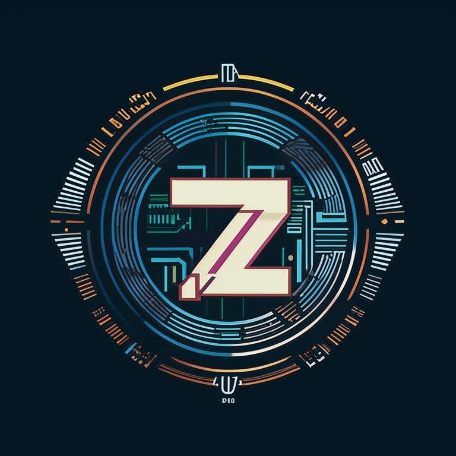

<!-- PROJECT SHIELDS -->
<!--
*** I'm using markdown "reference style" links for readability.
*** Reference links are enclosed in brackets [ ] instead of parentheses ( ).
*** See the bottom of this document for the declaration of the reference variables
*** for contributors-url, forks-url, etc. This is an optional, concise syntax you may use.
*** https://www.markdownguide.org/basic-syntax/#reference-style-links
-->
[![Contributors][contributors-shield]][contributors-url]
[![Forks][forks-shield]][forks-url]
[![Stargazers][stars-shield]][stars-url]
[![Issues][issues-shield]][issues-url]
[![MIT License][license-shield]][license-url]

<!-- PROJECT LOGO -->
 

  

<h3 align="center">ZSpec</h3>

  

    Z80 code tester and verificator
     
    <a href="https://github.com/svenyurgensson/zspec/tree/main/Readme.md"><strong>Explore the docs »</strong></a>
     
     
    <a href="https://github.com/svenyurgensson/zspec/tree/main/examples">View Examples</a>
    ·
    <a href="https://github.com/svenyurgensson/zspec/issues/new?labels=bug&template=bug-report---.md">Report Bug</a>
    ·
    <a href="https://github.com/svenyurgensson/zspec/issues/new?labels=enhancement&template=feature-request---.md">Request Feature</a>
  

<!-- TABLE OF CONTENTS -->

  
Table of Contents

  <ol>
    <li>
      <a href="#about-the-project">About The Project</a>
      <ul>
        <li><a href="#built-with">Built With</a></li>
      </ul>
    </li>
    <li>
      <a href="#getting-started">Getting Started</a>
      <ul>
        <li><a href="#prerequisites">Prerequisites</a></li>
        <li><a href="#installation">Installation</a></li>
      </ul>
    </li>
    <li><a href="#usage">Usage</a></li>
    <li><a href="#roadmap">Roadmap</a></li>
    <li><a href="#contributing">Contributing</a></li>
    <li><a href="#license">License</a></li>
    <li><a href="#contact">Contact</a></li>
    <li><a href="#acknowledgments">Acknowledgments</a></li>
  </ol>

<!-- ABOUT THE PROJECT -->
## About ZSpec

[![ZSpec Screen Shot][product-screenshot]](https://github.com/svenyurgensson/zspec)

Briefly – it is pretty pourly and carelessly written initial implementation tests for Z80 project's .

Perhaps, because of my long time work with high-level languages and web-projects I got a thought: why we doesn't have tests and specifications for Z80 projects? (May be they are exists, but I cannot found good one).

So I decided to make this one mainly with intention if someone wiser then me came and make something like this but much better.

(<a href="#readme-top">back to top</a>)

### Built With

* [Z80 emulator library][z80-emul-url]
* [TomlPlusPlus parser library][tomlplusplus-url]
* [Command line parser library][cmdparser-url]
* [Docker cross-compilers suit][dockcross-url]
* [Toml][toml-url]
* C++ compiler

(<a href="#readme-top">back to top</a>)

<!-- GETTING STARTED -->
## Getting Started

* Write some library with functions using you lovely compiler: c or asm or something other
* Compile it, export binary image and labels file
* Write specification, using simple language based on [Toml][toml-url] syntax
* Run `zspec path/to/ypur-zspec.toml`
* You have results of calling your code in tradition `green`/`red` style

BTW it is also possible run just one test from a few:

    zspec path/to/ypur-zspec.toml:5

it will run 5-th test, skipping others.

### Prerequisites

You need to have c++ compiler to build this project.

Or, instead you could take compiled version from `releases` folder.

### Installation

* `make` in project folder to build executable.
* copy executable somwhere to your `PATH`

(<a href="#readme-top">back to top</a>)

<!-- USAGE EXAMPLES -->
## Usage

ZSpec Toml file with comments:

    # Init is mandatory section where main test prerequisites should be placed
    [init]

        build = ["bin/run_zspec", "classic_screen",
    """
    const word START = 0xC000
    import lib/platform/classic/gfx/screen
    void main() @ START {
        Screen.pix.clear()
        Screen.full.clear()
        Screen.attr.fill(0)
        Screen.calc.line.down.de()
        Screen.calc.line.up.de()
        Screen.calc.line.down.hl()
        Screen.calc.line.up.hl()
        Screen.xy2screen(0, 0)
        Screen.xy2char(0, 0)
    }
    """
        ]

        # 'build' just runner for external programms, and if presents it have to be array of strings:
        # build[0] - filepath to external programm
        # build[1...] - arguments, given to that program
        # it runs before all tests and if in successful state ZSpect continue to work
        # Here we see example of calling external programm 'bin/run_zspec' which got with source of test bootstrap
        # code, this program save it into the temporary file, compile and if success returns with OK status to ZSpec
        # optional

        bin_file = "tmp/test/main.bin"
        # just binary image to load, size should be less then 64K
        # mandatory

        labels_file = "tmp/test/main.lbl"
        # load labels file, for ZSpec handle two formats: 'lbl' from Millfork compiler, and
        # 'sld' from sjasmplus assembler
        # optional

        load_addr = 0xC000
        # memory address to load bin_file, should be less then 0xFFFF-size_of(bin_file)
        # mandatory

    [[test]]
        name = "Clear pix area in Spectrum screen (6144 bytes)"
        # name of test
        # To skip this particular test, use 'xname'

        # test preconditions
        a = 0x01
        d = 0b1110_0001
        # you can use _ for readability
        bc = 0x2200
        hl = 32768
        hl_ = 42
        # alternate registers should be with underdash at the end
        IX = 0
        iy = 0xFFFF
        # use any case you want

        # setting registers is optional

        [test.run]
        # here describe how to run code, mandatory section

        # for better readibility use intendantion as you wish

            fname = "Screen_pix_clear"
            # you need to set 'fname' with string, name of function to run from labels file

            # or

            call = 0xc000
            # 'call' with address to run
            # mandatory

            max_ticks = 400000
            # how maximum T-States may run given testing function
            # optional

        [[test.init.memory]]
            start = 0x4000
            # address of memory to init
            # mandatory

            fill = [0xFF, 0x01, 0x00, 0x22]
            # sequence of bytes/words to store beginning from  'start'

            # or

            file = "path/to/bin/file"
            # loading binary data at memory starting from 'start'

            # either 'fill' or 'file' is mandatory directive

        [[test.init.memory]]
            start = 0x57FF

            word = true

            fill = [0xFF00]
            # if its need to store words instead of bytes use directive 'word' = true

        [[test.expect.memory]]
            address = 0x4000

            value = 0x00
            # what we expect to read from memory at 'address' after return from function

        [[test.expect.memory]]
            address = 0x8000
            word = true
            fill = [0xDEAD, 0xBEAF]
            # if its need to compare words instead of bytes use directive 'word' = true

        [test.expect.registers]
            de = 0x4100
            a = 0x00
            flg_z = true
            flg_c = false

            # check particular register state

        [test.expect.timing]
            max_ticks = 16150

            # or

            exact_ticks = 12000

            # expectation that given function will be run not more then 'max_ticks' or
            # exactly 'exact_ticks' T-States

    [[test]]
        # next test...

_For more examples, please refer to the [Examples](https://github.com/svenyurgensson/zspec/tree/main/examples)_

(<a href="#readme-top">back to top</a>)

<!-- ROADMAP -->
## Roadmap

- [ ] Add ability to load binary file for memory comparing expectations
- [ ] Add ports expectations
- [ ] More documentation and examples
- [x] Memory series expectations
- [x] Add command line params

See the [open issues](https://github.com/svenyurgensson/zspec/issues) for a full list of proposed features (and known issues).

(<a href="#readme-top">back to top</a>)

<!-- CONTRIBUTING -->
## Contributing

Contributions are what make the open source community such an amazing place to learn, inspire, and create. Any contributions you make are **greatly appreciated**.

If you have a suggestion that would make this better, please fork the repo and create a pull request. You can also simply open an issue with the tag "enhancement".
Don't forget to give the project a star! Thanks again!

1. Fork the Project
2. Create your Feature Branch (`git checkout -b feature/AmazingFeature`)
3. Commit your Changes (`git commit -m 'Add some AmazingFeature'`)
4. Push to the Branch (`git push origin feature/AmazingFeature`)
5. Open a Pull Request

(<a href="#readme-top">back to top</a>)

<!-- LICENSE -->
## License

Distributed under the MIT License. See `LICENSE.txt` for more information.

(<a href="#readme-top">back to top</a>)

<!-- CONTACT -->
## Contact

Yury Batenko - jurbat@gmail.com

Project Link: [https://github.com/svenyurgensson/zspec](https://github.com/svenyurgensson/zspec)

(<a href="#readme-top">back to top</a>)

<!-- ACKNOWLEDGMENTS -->
## Acknowledgments

(<a href="#readme-top">back to top</a>)

<!-- MARKDOWN LINKS & IMAGES -->
<!-- https://www.markdownguide.org/basic-syntax/#reference-style-links -->
[contributors-shield]: https://img.shields.io/github/contributors/svenyurgensson/zspec.svg?style=for-the-badge
[contributors-url]: https://github.com/svenyurgensson/zspec/graphs/contributors
[forks-shield]: https://img.shields.io/github/forks/svenyurgensson/zspec.svg?style=for-the-badge
[forks-url]: https://github.com/svenyurgensson/zspec/network/members
[stars-shield]: https://img.shields.io/github/stars/svenyurgensson/zspec.svg?style=for-the-badge
[stars-url]: https://github.com/svenyurgensson/zspec/stargazers
[issues-shield]: https://img.shields.io/github/issues/svenyurgensson/zspec.svg?style=for-the-badge
[issues-url]: https://github.com/svenyurgensson/zspec/issues
[license-shield]: https://img.shields.io/github/license/svenyurgensson/zspec.svg?style=for-the-badge
[license-url]: https://github.com/svenyurgensson/zspec/blob/master/LICENSE.txt
[product-screenshot]: assets/screenshot.png

[z80-emul-url]: https://github.com/suzukiplan/z80
[toml-url]: https://toml.io/en/
[tomlplusplus-url]: https://github.com/marzer/tomlplusplus
[cmdparser-url]: https://github.com/FlorianRappl/CmdParser
[dockcross-url]: https://github.com/dockcross/dockcross